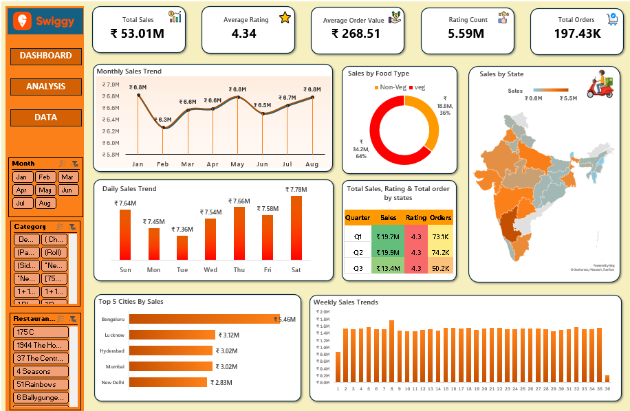

# Swiggy Sales Dashboard – Excel Project

An interactive Excel dashboard analyzing Swiggy's sales performance, built using pivot tables, charts, slicers, and conditional formatting to track key business metrics across time, food category, and geography.

## 📊 Dashboard Preview

## 🔑 Key Metrics Tracked

- **Total Sales:** ₹53.01M
- **Average Rating:** 4.34
- **Average Order Value:** ₹268.51
- **Rating Count:** 5.59M
- **Total Orders:** 197.43K

## 📈 Dashboard Features

- **Monthly & Daily Sales Trend** – Line and bar charts showing sales patterns across months and days of the week
- **Sales by Food Type** – Donut chart comparing Veg vs Non-Veg sales contribution
- **Sales by State** – Filled map visualization highlighting sales distribution across India
- **Quarterly Summary Table** – Sales, rating, and order count broken down by quarter
- **Top 5 Cities by Sales** – Bar chart ranking top-performing cities (Bengaluru, Lucknow, Hyderabad, Mumbai, New Delhi)
- **Weekly Sales Trend** – 36-week sales trend for granular performance tracking
- **Interactive Filters/Slicers** – Filter by Month, Category, and Restaurant for dynamic analysis

## 🛠️ Tools & Skills Used

- Microsoft Excel
- Pivot Tables & Pivot Charts
- Slicers (interactive filtering)
- Conditional Formatting
- Dashboard Design (KPI cards, donut charts, maps, bar/line charts)

## 💡 Key Insights

- Non-Veg items contribute a larger share (64%) of total sales compared to Veg (36%)
- Bengaluru is the top-performing city, generating ₹5.46M in sales
- Sales trend shows a steady climb from Jan to Aug with a slight dip in Feb

## 📁 Files in this Repository

| File | Description |
|------|-------------|
| `Aftab_Swiggy_Project.xlsx` | Full Excel workbook with raw data, pivot tables, and dashboard |
| `Aftab_Swiggy_Project.png` | Dashboard screenshot preview |

## 👤 Author

**Mohammed Aftab**
Aspiring Data Analyst | Excel • SQL • Power BI • Tableau • Python
